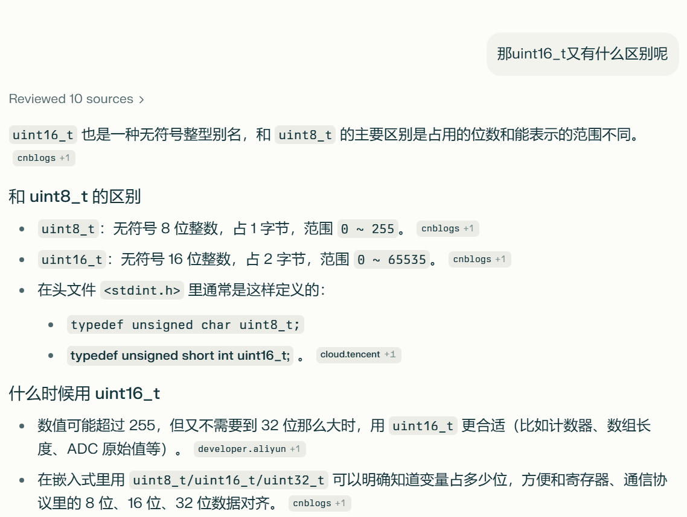

0.环境搭建(Keil + CubeMX,用最新版本，去官网下载)
1.U5板子支持FreeRTOS
2.U5板子可以通过串口MODBUS协议控制外设(中断做数据接收，数据包解析在任务中完成,通过消息队列传递数据)
3.U5板子ESP8266支持MQTT通信(不允许使用网盘代码，使用 EMQX免费在线服务器)
4.U5板子和指纹STM32之间可以通过自有协议通信 (RS485:MODBUS协议格式)
时间节点:12月24日-12月30日

一字节=2位16进制=1一个uint8_t=8bits